# Dialogue Atlas Relay

Dialogue Atlas Relay は、個人の AI 対話を、チームで共同レビューできる小さな意思決定マップへ変換します。参加者は根拠を確認し、異議を示し、提案を通じて内容を更新できます。アクションを Devin に引き渡せるのは、ルームオーナーが明示的に承認した後だけです。

本プロダクトには、役割の異なる二つの画面があります。

- **Dialogue Atlas for macOS**：Codex JSONL、画面上で確認できる対話、モデル分析、修正内容、根拠資料をオーナーの Mac 内に保持します。
- **Relay Web**：明示的に公開承認されたグラフパッケージだけを受け取り、Supabase を通じてリアルタイムの構造化コラボレーションを提供します。

これは汎用ホワイトボードではありません。共同作業の単位は自由形式の付箋ではなく、主張、問い、意思決定、関係、根拠要求、アクションです。

このリポジトリには、Relay の実装、オフライン fixture、localhost 上で検証済みの Supabase 2 クライアント smoke test が含まれます。一方で、ホスト済み Supabase、Vercel、Devin の本番デプロイまで検証済みだとは主張していません。外部環境に関するリリース条件は「[検証範囲](#検証範囲)」に記載しています。

## デモの流れ

1. ローカルの対話カレンダーから実際の会話を開きます。
2. 論点グラフと、ローカルに保存された正確な根拠を確認します。
3. **发布协作空间（共同スペースを公開）**を開き、公開するグラフノードを個別に承認します。根拠の抜粋は初期状態ではすべて非公開で、一件ずつ承認する必要があります。
4. 2 台目のブラウザが招待リンクから参加します。両クライアントで Presence、選択状態、チームノード、提案、スタンス、コメント、レイアウト変更が同期されます。
5. メンバーが公開済みの関係に異議を示します。オーナーは不変のソースパッケージを書き換えずに、その提案を承認、却下、または保留できます。
6. 承認された意思決定は、オーナー承認済みの Action Brief になります。その後に限り、固定された canonical repository に対する Devin Session を開始できます。
7. Relay は、サニタイズ済みの Devin Session event log、Session URL、許可リストに一致する PR URL を、それぞれ独立した根拠として表示します。GitHub Checks は未統合のため、CI/check 状態は現在 `unknown` です。PR が作成されたことだけで、作業が承認済みであるかのようには表示しません。

## アーキテクチャ

```mermaid
flowchart LR
  A["ローカル Codex JSONL"] --> B["macOS でのインポートと分析"]
  B --> C["SQLite effective snapshot"]
  C --> D["ノードと根拠の公開承認"]
  D --> E["RelayPackageV1"]
  E --> F["Supabase room と不変の atlas version"]
  F <--> G["Relay Web の参加者"]
  G --> H["チームノード、スタンス、提案、意思決定"]
  H --> I["オーナー承認済み Action Brief"]
  I --> J["Supabase Edge Function"]
  J --> K["Devin Session と GitHub PR"]
```



リポジトリ構成：

```text
src/                         macOS companion UI
src-tauri/                   ローカルインポート、分析、SQLite、プライバシー公開処理
apps/relay-web/              Vercel 向け Web エントリ
packages/atlas-graph/        callback-driven な公開グラフビュー
packages/relay-contract/     allowlist DTO と runtime validation
packages/relay-room/         共通ルーム UI と transport-injected controller
packages/relay-supabase/     Supabase repository と Realtime adapter
supabase/                    schema、RLS、RPC、pgTAP、Devin Edge Function
```

詳細は [Relay architecture](docs/relay-architecture.md) と [privacy contract](docs/relay-privacy.md) を参照してください。

## プライバシー境界

Relay は raw JSONL、完全な transcript、ローカルの source path、ローカル ID、prompt/provider 設定、validation object、raw model output、reasoning、tool record をアップロードしません。

`RelayPackageV1` は、許可項目だけを含む projection です。

- 公開 ID は `n001`、`r001`、`m001`、`e001` の形式で再採番します。
- 公開できるノードは、承認済みのものを最大 120 件までとします。
- 公開されていない端点を持つ relation と、空の mode は削除します。
- すべての座標は有限値でなければならず、グラフ内の参照は閉じている必要があります。
- メールアドレス、絶対パス、UUID、credential に見える文字列、private snapshot key は拒否します。
- 根拠は、オーナーが該当する抜粋を明示的にチェックしない限り含まれません。

ローカル ID と公開 ID の対応表、および公開 receipt はローカル SQLite に残ります。Supabase に保存されるのは、承認されたパッケージと、その後ルーム内で追加された共同作業データだけです。

## ローカル対話分析

Companion は Codex rollout JSONL から、画面上で確認できる `user` と `assistant` のメッセージを読み取ります。Developer instruction、reasoning、tool call/result、重複 event message、未対応 media、既知の ambient/injected wrapper は除外します。貼り付けによるインポートと、アプリの header marker を持つ visible export にも対応しています。

macOS では、OpenAI API またはローカルで監査された Codex-via-ChatGPT 経路を使って分析できます。構造化されたモデル出力は、ローカルでも再検証されます。引用された根拠が原文中に完全一致で存在すること、UTF-16 offset が一致すること、グラフ端点が存在することを確認します。モデル分析は Relay Web の live path には含まれず、チームデモの実行中にも必要ありません。

分析進捗ダイアログを閉じても、処理はキャンセルされません。アプリが開いている間はバックグラウンドで継続し、カレンダーから進捗画面を再度開けます。キャンセルを要求するのは、明示的な **停止分析** 操作だけです。バックグラウンドで完了しても、ユーザーを別画面へ強制的に移動させずにステータスを更新します。

## コラボレーションの意味規則

- 公開済みの source layer は不変です。
- メンバーは team node と team relationship を追加し、自分が追加した内容を編集できます。他のメンバーの team item を変更する場合は proposal が必要です。
- 公開済みの意味内容に対する変更は direct write ではなく proposal として扱います。
- Confirm、challenge、needs-evidence の stance は併存します。あるメンバーの stance が他のメンバーの stance を消すことはありません。
- Proposal の決定、Action Brief の作成、ルームの終了、Devin の開始を行えるのはオーナーだけです。
- 既存ルームに再公開すると、新しい不変の atlas version が作成されます。Source ID、layout、team overlay、stance、proposal は version 単位で管理されるため、再生成された `n001` / `r001` が旧 version の意味を誤って継承することはありません。旧データも保持されます。
- Comment、decision、activity、atlas version は append-only です。
- 永続化する mutation は、まず Postgres に書き込みます。Presence、focus、typing、drag preview は一時的な Realtime signal です。
- Layout と team item は revision compare-and-swap を使います。競合時はルームを暗黙に上書きせず、ローカル draft を保持します。
- 再接続時は単調増加する activity sequence を replay し、RLS で保護された record を再取得します。

Supabase Anonymous Auth のユーザーも、データベース上では `authenticated` role を使用します。RLS はすべての公開 table と private Realtime channel を保護します。招待 token が与えるのは membership であり、owner authority ではありません。

## Devin との境界

Run を開始する際、ブラウザから Edge Function に送るのは `roomId`、`actionBriefId`、idempotency key、および `start` operation discriminator だけです。Function は owner-only database RPC を通じて承認済み Action Brief を再取得し、次の内容を固定します。

- Repository：`visiontale7-svg/AIAU-Salary-neko`
- Baseline SHA
- 変更を許可する repository-relative file
- Acceptance command
- 禁止事項
- 承認済みの最小限の context と ACU limit

クライアントから organization、repository、secret、完全な transcript、任意の Devin prompt を受け取ることはありません。Status request が指定するのは room と run だけです。オーナーによる follow-up には、その本文と idempotency key が必要です。本文はスキャンされた後に `devin_events` へ保存され、Devin に送信され、その run を閲覧できる room member に表示されます。Provider message は永続化前にサニタイズされ、PR URL は canonical repository に属するものだけを許可します。

Anonymous user が room owner であることは、有料 provider の利用権限を意味しません。Server が管理する private table `devin_entitlements` の row で、その owner が明示的に許可され、有効期限内であり、1 日の run quota 内にあり、operator が設定した ACU ceiling を持つ必要があります。Browser role はこの table を読み書きできません。Provider snapshot/event の保存には service-role RPC だけを使用できます。

## 開発

必要環境：Node.js 24.x、Rust、Xcode Command Line Tools、および Apple Silicon macOS 向け Tauri の前提環境。

```bash
npm ci
npm run typecheck
npm test
npm run typecheck:relay
npm run test:relay
npm run build:relay
npm run check:relay-boundaries
npm run check:rust
npm run test:rust
```

Desktop 開発：

```bash
npm run tauri dev
```

Relay Web 開発：

```bash
npm run dev --workspace @dialogue-atlas/relay-web
```

明示的な integration flag がない場合、このコマンドはブラウザ内だけで動く static fixture を表示します。ローカルファイルを読み込まず、model、Supabase、OpenAI、Codex、Devin への接続も行いません。Production adapter が選択されるのは production build、または後述する local-only loopback mode の場合です。

Production adapter をローカルで動かすには、Relay Web 用の二つの公開値を `apps/relay-web/.env.production.local` に置くか、build process に渡してから、production output を build・preview します。

```bash
npm run build:relay
npm exec --workspace @dialogue-atlas/relay-web -- vite preview
```

この preview は実際にネットワークへ接続します。Disposable な Supabase project を使用し、service-role key や Devin secret を Vite の環境変数ファイルに入れないでください。

完全なローカル collaboration smoke test を行うには、Docker 互換 runtime と Supabase CLI をインストールし、repository stack を起動して migration を適用します。

```bash
supabase start
supabase db reset
supabase test db
supabase status -o env
```

出力された local API URL と public publishable/anon key だけを shell にコピーします。明示的な loopback flag を付けて Relay Web を起動します。

```bash
VITE_RELAY_LOCAL_INTEGRATION=1 \
VITE_SUPABASE_URL=http://127.0.0.1:54321 \
VITE_SUPABASE_PUBLISHABLE_KEY=<local-public-key> \
npm run dev --workspace @dialogue-atlas/relay-web -- --host 127.0.0.1 --port 4173
```

Desktop owner を build または実行する shell には、同じ三つの値と `VITE_RELAY_WEB_URL=http://127.0.0.1:4173` を設定します。Exact-origin CSP overlay を生成して渡してください。

```bash
npm run prepare:relay-tauri-config
npm run tauri -- dev --config src-tauri/tauri.relay.generated.conf.json
```

`VITE_RELAY_LOCAL_INTEGRATION=1` が平文通信を許可するのは、完全一致する loopback host に対してだけです。Vercel や配布 build では設定しないでください。この local room flow は Anonymous Auth、RLS、Postgres persistence、private Realtime、Presence、proposal、shared graph mutation を検証します。Devin の起動や接続は行いません。

## Supabase と Vercel の設定

Relay Web production build の値（Vercel Project Environment、またはローカル production preview 用の ignored file `apps/relay-web/.env.production.local` に設定）：

```text
VITE_SUPABASE_URL=https://<project-ref>.supabase.co
VITE_SUPABASE_PUBLISHABLE_KEY=<publishable key>
```

macOS publisher は、同じ二つの公開 Supabase 値と、デプロイ済み Relay URL を使用します。Tauri overlay を生成する際に、shell または ignored root `.env` / `.env.production` file から次の値を渡します。

```text
VITE_RELAY_WEB_URL=https://<relay-deployment>
```

Packaged macOS の CSP には、Supabase の完全一致する HTTPS origin と、Realtime の完全一致する `wss://` origin を指定する必要があります。Wildcard は意図的に使用していません。Generator は、明示的な local-integration flag がある場合に限り、完全一致する loopback HTTP/WS も受け付けます。

Relay 対応 desktop build の前に、ignored の exact-origin Tauri overlay を生成します。

```bash
# 値は shell、またはローカルの .env/.env.production file から渡せます。
npm run prepare:relay-tauri-config
npm run tauri -- build --config src-tauri/tauri.relay.generated.conf.json
```

Server-only Edge Function secret：

```text
DEVIN_API_KEY
DEVIN_ORG_ID
DEVIN_REPO=visiontale7-svg/AIAU-Salary-neko
DEVIN_MAX_ACU_LIMIT
RELAY_ALLOWED_ORIGINS
```

`RELAY_ALLOWED_ORIGINS` には、Vercel の完全一致する origin と、実行時に確認した packaged desktop の origin（通常は `tauri://localhost`）を含めます。推測せず、実際の値を確認してください。これは CORS allowlist であり、authorization mechanism ではありません。

`SUPABASE_SERVICE_ROLE_KEY` はデプロイされた Edge Function だけが利用し、provider 由来の status/event の書き込みに使用します。Live demo の前に、operator は対象となる anonymous owner UUID を `relay_private.devin_entitlements` に登録する必要があります。Room owner であることだけでは不十分です。

Supabase CLI を利用できる環境で database gate を実行します。

```bash
supabase db reset
supabase test db
supabase functions serve devin-relay
```

Vercel は repository root で `npm ci` を実行し、`npm run build:relay` で build して、`apps/relay-web/dist` を公開します。Production deployment では、Vercel に `VITE_SUPABASE_URL` と `VITE_SUPABASE_PUBLISHABLE_KEY` を設定する必要があります。`VITE_RELAY_WEB_URL` は desktop build 用の値であり、Relay Web の runtime value ではありません。

## 検証範囲

ローカルの TypeScript、Vitest、Rust、browser fixture、privacy scan、build は service credential なしで実行できます。次の項目は独立した deployment gate であり、ローカル build が成功しただけで完了とみなすことはできません。

- Canonical repository に対する GitHub Write access と branch protection
- Migration、Anonymous Auth、private Realtime、pgTAP を実行した hosted Supabase project
- Vercel production deployment
- 必要な organization permission を持つ Devin service user
- 実際の Devin Session → branch/PR → CI → human review の smoke test
- 外部配布用 macOS application の Developer ID signing と notarization

作業ツリーを commit 済みかつ clean にした後、[scripts/export-public-baseline.sh](scripts/export-public-baseline.sh) を使用して、履歴を引き継がない公開 source export を作成できます。この script は internal planning、build product、credential、database、log、platform handoff material を除外し、最初の commit を作成する前に export 内容をスキャンします。

## ライセンス

[MIT](LICENSE)

## MVP の制限

Relay v1 は、1 ルームにつき 2〜5 人の共同作業を想定しています。自由描画、任意 media、rich-text CRDT、room 横断検索、organization 管理、notification、cloud-side conversation analysis、raw transcript sync、proposal の自動承認、`main` への直接書き込みは提供しません。Anonymous identity は device-local であり、browser storage を削除すると復元できません。
